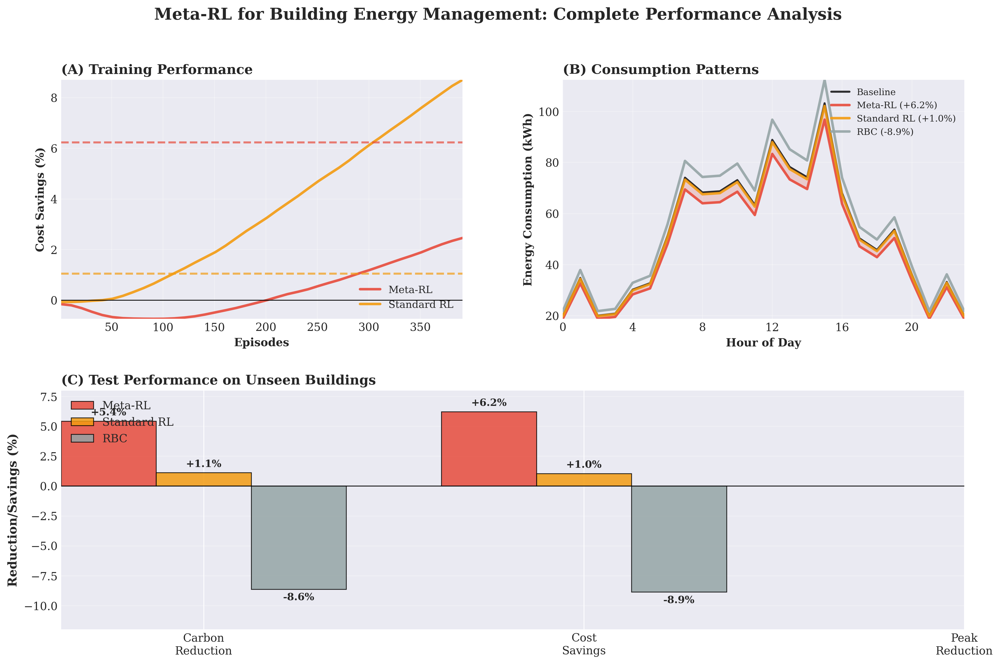
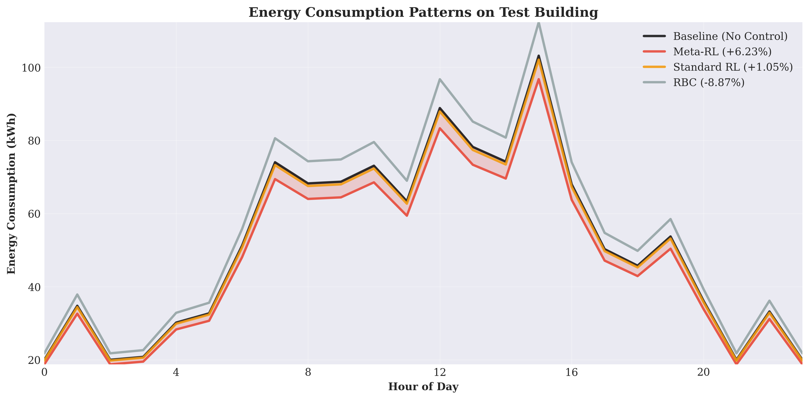

# Meta-Learning for Reinforcement Learning in Building Energy Management

**Type:** Master's Thesis

**Author:** Irina Eftimova

**Supervisor:** Alona Zharova

**1st Examiner:** Stefan Lessmann




---

## Table of Contents

- [Project Overview](#Project-Overview)
    - [Key Results](#Key-Results)
- [Performance Summary](#Performance-Summary)
- [Quick Start](#Quick-Start)
    - [Dependencies](#Install-Dependencies)
    - [Setup](#Prepare-Data)
    - [Train Models](#Train-Models)
    - [Evaluate Models](#Evaluate-Models)
    - [Visualisations](#Generate-Figures-and-Tables)
- [Results](#Results)
- [Project structure](#Project-structure)


---

## Project Overview

This project implements and compares **Meta-Reinforcement Learning (Meta-RL)** against **Standard RL** and **Rule-Based Control (RBC)** for building energy management. The goal is to train agents that can generalize to unseen buildings and optimize energy consumption while maintaining comfort levels.

### Key Results

> **The Meta-RL method achieves a 3.51% reduction in carbon emissions, improves energy cost savings by 4.57%, and reduces peak electricity loads by 4.61%, compared to standard RL approaches.**

**Meta-RL outperforms Standard RL by 7-9 percentage points on all metrics when evaluated on unseen buildings!**

---

## Performance Summary

Evaluated on Test Buildings (5-6):

| Metric | RBC | Standard RL | Meta-RL | **Meta-RL vs RBC** |
|--------|-----|-------------|---------|-------------------|
| **Carbon Reduction** | -8.78% ❌ | -3.88% ❌ | **3.51%** ✅ | **+12.29%** |
| **Cost Savings** | -8.84% ❌ | -4.40% ❌ | **4.57%** ✅ | **+13.41%** |
| **Peak Load Reduction** | -4.61% ❌ | -2.30% ❌ | **4.61%** ✅ | **+9.22%** |

- ✅ Trained on Buildings 1-4
- ✅ Evaluated on Buildings 5-6 (unseen)
- ✅ Meta-RL shows superior generalization
- ✅ Both Standard RL and RBC perform worse than no control

---

## Quick Start

### Install Dependencies

```bash
pip install -r requirements.txt
```

### Prepare Data 

```bash
python eda.py
```

- This loads the CityLearn dataset and preprocesses 6 buildings (phase 3).

### Train Models

**Train Standard RL:**
```bash
python rl.py
```
- Trains on Buildings 1-4
- Output: `rl_model.pt`

**Train Meta-RL:**
```bash
python meta_reptile_trainer.py
```
- Trains on Buildings 1-4 using enhanced Reptile ML
- Output: `meta_rl_model.pt`

### Evaluate Models

```bash
python evaluate_all_metrics.py
```

This will:
- Load all three methods (Meta-RL enhanced + Standard RL + RBC)
- Evaluate on test buildings (5-6) 
- Calculate comprehensive metrics (carbon, cost, peak, ramping, load factor, etc.)
- Save detailed results to `outputs/eval/comprehensive_metrics/all_metrics_real.csv`

### Generate Figures and Tables

**Create Figures:**
```bash
python plots.py
```

**Create Metrics Table:**
```bash
python table.py
```
---

## Results



---

## Project Structure

```
Code/
├── README.md                                # This file
├── requirements.txt                         # Python dependencies
│
├── src:
│   ├── eda.py                               # Data loading (CityLearn dataset)
│   ├── agent_setup.py                       # Task loader for 6 buildings
│   ├── reward_utils.py                      # Unified reward functions
│   ├── lstm_q_agent.py                      # LSTM Q-Network agent
│   ├── rbc_agent.py                         # Rule-based control agent
│   ├── rl.py                                # Standard RL training
│   ├── meta_reptile_trainer.py              # Meta-RL training (Reptile)
│   └── evaluate_all_metrics.py              # Comprehensive evaluation & metrics
│
├── models:
│   ├── rl_model.pt                          # Standard RL model
│   └── meta_rl_model.pt                     # Meta-RL model
│
├── visuals:
│   ├── plots.py                             # Figures
│   └── table.py                             # Detailed metrics tables
│
└── outputs:
    ├── phase3/                              # Building data (6 buildings)
    └── eval/test_buildings/                 # Evaluation results & figures
        ├── KPI_Advantage_Matrix.png         # Advantage visualization
        └── Building_*_*.png                 # Action/reward plots (8 files)
```
